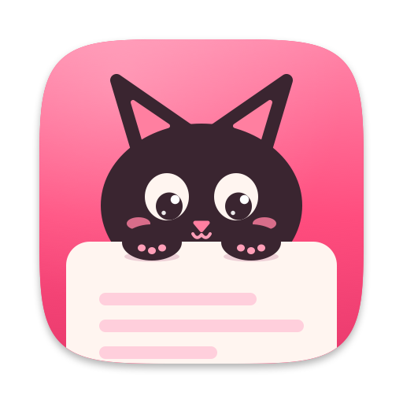
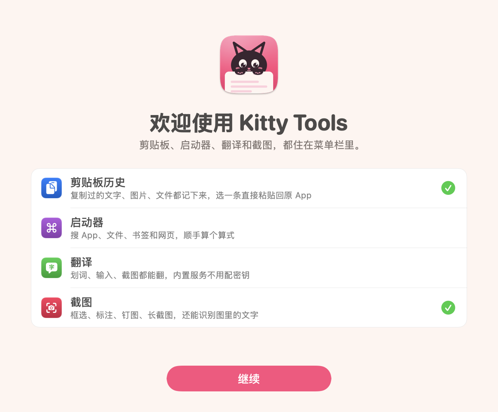
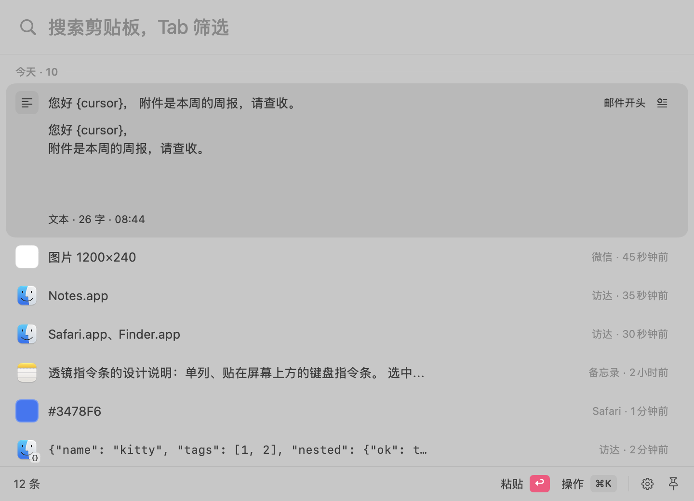
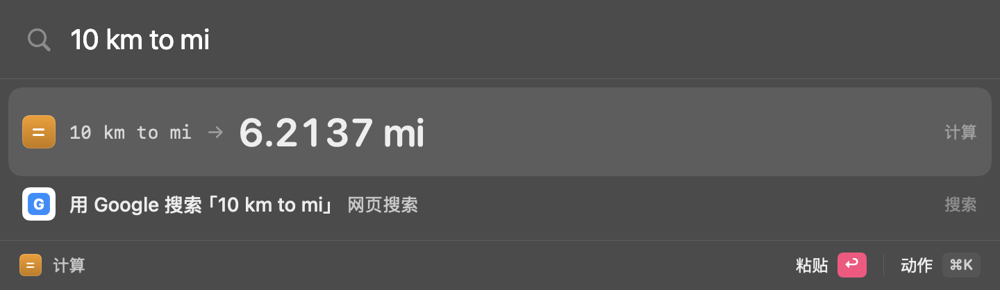
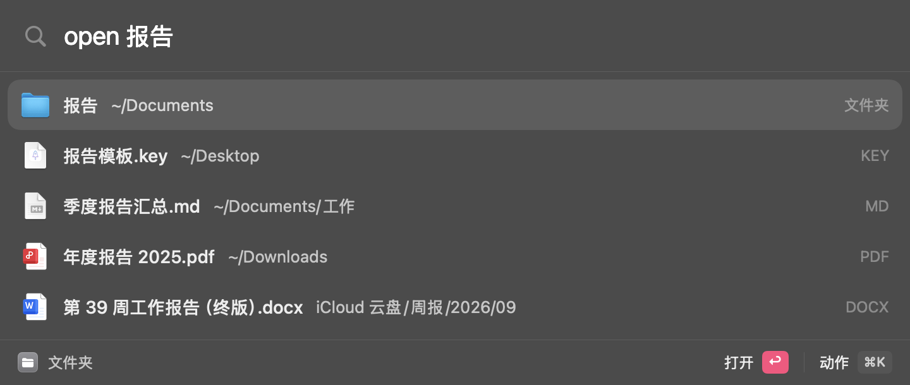
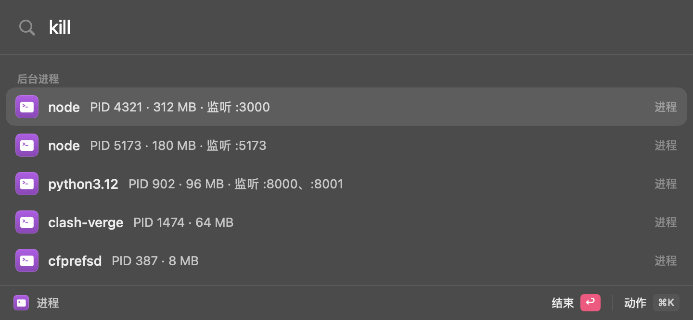
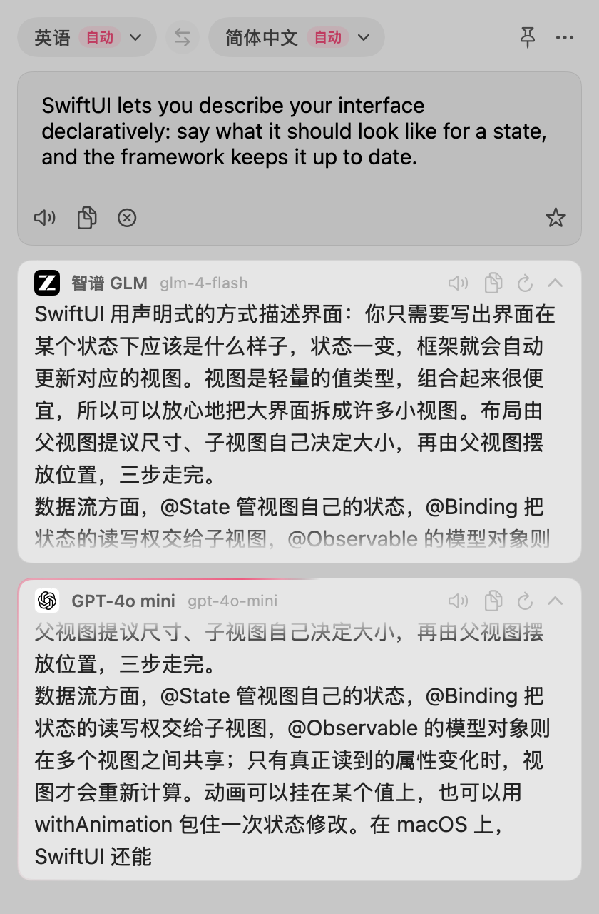
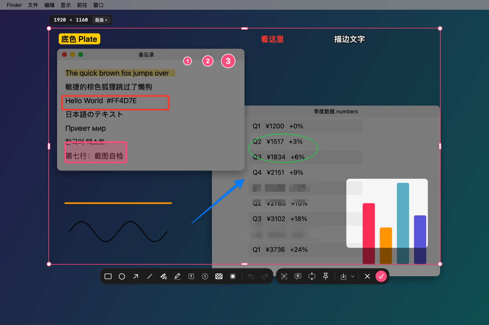
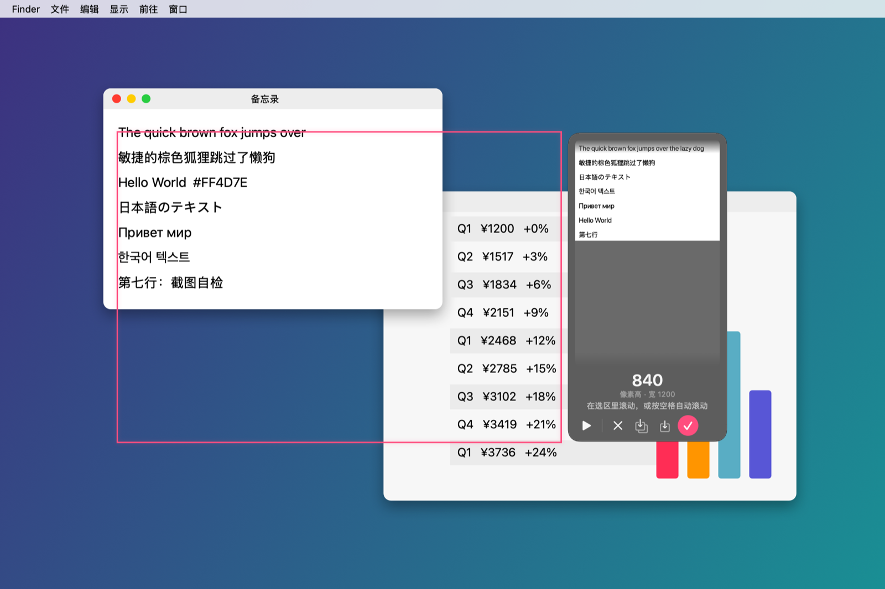
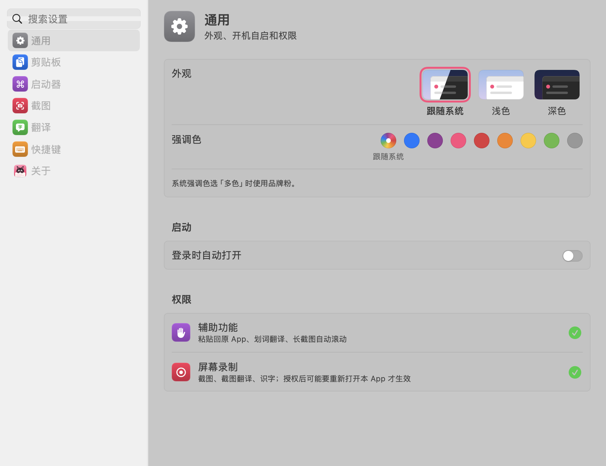

<p align="center">
  
</p>

<h1 align="center">Kitty Tools</h1>

<p align="center">
  纯原生的 macOS 菜单栏效率工具：剪贴板历史 · 启动器 · 翻译 · 截图
</p>

<p align="center">
  
  
  
  
  <a href="https://github.com/YyAdnBug/kitty-tools/releases/latest"></a>
</p>

<p align="center">
  
</p>

Kitty Tools 用 Swift 6 + SwiftUI / AppKit 写成，常驻菜单栏、不占程序坞，四个工具都用全局快捷键呼出，弹出时不抢前台 App 的焦点，选好内容能直接粘贴回原来的 App。识字、语种检测和敏感内容识别都在本机完成，密钥存在系统钥匙串里。支持浅色 / 深色外观，强调色可以自选，新版本在 App 内一键更新。

> 个人项目，持续更新中。只支持 Apple 芯片、macOS 15 及以上。

## 功能

### 📋 剪贴板历史

<p align="center">
  
</p>

- 自动记录复制过的**文本（保留格式）、图片和文件**，重复内容只挪到最前面
- **键盘优先**：↩ 粘贴回原 App，⌥↩ 粘贴纯文本，⌘1–9 直接粘贴第 N 条，多选后合并粘贴，删除后 ⌘Z 连着撤销
- **透镜预览**：选中条目原地展开，代码 / JSON 带行号和语法着色，颜色显示 HEX / RGB / HSL，链接显示标题和头图；⌘Y 放大预览
- **搜索**：正文、图片里的文字（本机识别，不联网）、文件路径、备注、来源 App 都能搜；Tab 按类型、内容形态、来源 App、收藏夹筛选
- **收藏夹、片段、备注**：收藏可以分进多个收藏夹，任何条目都能写备注；片段支持 `{date}`、`{time}`、`{uuid}`、`{clipboard:N}`、`{cursor}` 等占位符；收藏和片段不会被自动清理
- **顺手的操作**：文件 ⌘O 打开、⌘R 在访达中显示，⌘T 翻译选中条目，图片钉到屏幕，条目直接拖进别的 App
- **隐私**：跳过密码管理器和带隐私标记的内容，可排除指定 App、临时暂停记录，自动拦截 API Key、Bearer Token、银行卡号等敏感文本；普通历史保留 1 天到永久，可限制图片占用，退出或锁屏时清空

### 🚀 启动器

<p align="center">
  
  <br><br>
  
  <br><br>
  
</p>

- **搜 App**：中文名、拼音全拼和首字母都能搜（「huodong」「hdjsq」都能找到活动监视器），按使用频率排序，越用越顺手；⌘D 收藏常用项，空输入时排在最前
- **文件搜索**：`open 文件名` 打开，`find 文件名` 在访达中选中，支持中文和拼音；⌘Y 快速查看，⌘K 用其他 App 打开或移到废纸篓
- **计算器与换算**：四则运算、百分比、乘方、函数；单位换算（`10 km to mi`、`30 摄氏度 转 华氏度`）、进制转换（`255 in hex`），↩ 直接粘贴结果
- **系统命令**：`lock`、`sleep`、`restart`、`emptytrash`、`mute` 等（中文、拼音也行）；`quit` / `hide` / `forcequit` 管理正在运行的 App，`eject` 推出磁盘，`kill` 结束进程或按端口找（`kill :3000`），`port` 看哪些端口被占着、是谁占的（`port 3000`）
- **系统设置直达**：搜「蓝牙」「显示器」「隐私与安全性」，↩ 跳到对应的设置页
- **网页搜索**：`g swift`、`gh swift` 这样用关键词直达，预置 Google、Bing、百度、GitHub、知乎、哔哩哔哩等 13 个引擎，可自定义搜索和快捷链接
- **浏览器书签与历史**：Safari、Chrome、Edge、Arc、Brave、Firefox 等，只列本机装了的，带网站图标；输入网址或 `~/` 路径直接打开
- `cb 关键词` 跳到剪贴板历史搜索，`fy 文字` 直接翻译，⌘K 或 → 打开动作菜单

### 🌐 翻译



- **划词翻译**：在任意 App 里选中文字按快捷键就翻译，浮窗跟着鼠标出现；取不到选区时自动改用 ⌘C 取词，用完把剪贴板恢复原样
- **输入翻译、复制即译、截图翻译**：框选屏幕上的文字，本机识别后翻译
- **多服务并行**：智谱 GLM（内置，开箱即用）、百度、有道、Google、DeepL / DeepLX、微软（不填密钥也能用）、火山、腾讯，以及 OpenAI / Azure OpenAI / Anthropic 协议的大模型；DeepSeek、Kimi、通义千问、硅基流动、OpenRouter、Gemini、Ollama 等有预设，填好密钥就能用；大模型的译文边生成边显示
- **查词**：单个词显示系统词典释义卡片，大模型按词典格式回答
- **替换原文**：用译文直接替换原 App 里选中的文字，也可以设一个静默热键，一按即替换
- **翻译历史 / 生词本**：可搜索、收藏，导出 CSV 或可直接导入 Anki 的 TSV
- 支持 11 种语言，目标语言选「自动」时在第一 / 第二语言之间互译；支持朗读、自动复制译文

<br clear="right">

### ✂️ 截图

<p align="center">
  
</p>

- **框选**：先冻结屏幕再框选，悬停自动识别窗口，吸附窗口边和屏幕边；尺寸可直接输入，比例可锁定
- **放大镜取色**：按 C 复制光标处的 `#RRGGBB`
- **10 种标注工具**：矩形、椭圆、箭头（可拖成弧线）、直线、画笔、荧光笔、文字、序号、马赛克、聚光灯，用数字键 1–0 切换；标注画完后仍能移动、改大小、复制，支持撤销 / 重做
- **出图**：↩ 拷贝，⌘S 保存 PNG，T 钉在屏幕上当参考（钉图也能识字、翻译、保存），O 识字（也能识别二维码），一键送去翻译
- **长截图**：框选后按 S，在选区里滚动就自动拼接，按空格自动滚动
- 截图后缩略图停在屏幕右下角，可以直接拖出成文件；识字、取色等结果从刘海处弹出轻提示

<p align="center">
  
</p>

### ⚙️ 设置

<p align="center">
  
</p>

外观（跟随系统 / 浅色 / 深色）、8 种强调色、开机自启、权限状态、全局快捷键录制都在设置窗里，侧栏可以搜索设置项。菜单栏图标可以换成彩色，也可以整个隐藏（快捷键照常能用）。

## 默认快捷键

| 功能 | 快捷键 |
|---|---|
| 剪贴板历史 | `⌥C` |
| 启动器 | `⌥Space` |
| 划词翻译 | `⌥D` |
| 输入翻译 | `⌥T` |
| 截图翻译 | `⌥S` |
| 截图 | `⌥A` |
| 截取上次区域 | `⌥X` |
| 识字（OCR / 二维码） | `⌥O` |
| 划词翻译并替换 | 默认不设，需要时自己录制 |

所有快捷键都能在「设置 › 快捷键」里改。macOS 15.0 / 15.1 不允许注册只带 ⌥ 的组合，在这两个版本上请改成带 ⌘ 或 ⌃ 的组合（快捷键页会提示）。

## 安装

1. 从 [Releases](https://github.com/YyAdnBug/kitty-tools/releases/latest) 下载 `Kitty.Tools_x.y.z_arm64.dmg`（`_arm64.zip` 是 App 内更新用的，不用手动下载），或按下面的步骤自己打包。
2. 把 `Kitty Tools.app` 拖进「应用程序」。
3. App 使用 Apple Development 签名、没有公证，第一次打开会被系统拦下（提示「未打开」，不是「已损坏」）：到「系统设置 › 隐私与安全性」里点「仍要打开」。也可以在终端执行：
   ```bash
   xattr -dr com.apple.quarantine "/Applications/Kitty Tools.app"
   ```
4. 按首次启动的欢迎引导授权：
   - **辅助功能**：粘贴回原 App、划词翻译、替换原文、长截图自动滚动
   - **屏幕录制**：截图、截图翻译、识字、长截图（授权后可能需要重新打开 App）
   - **文件和文件夹**：只在启动器文件搜索时按需申请
   - **完全磁盘访问权限**（可选）：只在要搜 Safari 书签和历史时需要

只有第一次安装要放行；之后有新版本时菜单栏会出现「更新到 x.y.z…」，一键更新，不用再放行。

## 从源码构建

需要 Xcode 26.3 和 Apple 芯片的 Mac，没有任何第三方依赖。

```bash
git clone https://github.com/YyAdnBug/kitty-tools.git
cd kitty-tools
xcodebuild -project macos/KittyTools.xcodeproj -scheme KittyTools build
```

- **签名**：`macos/Config/Base.xcconfig` 里的 `DEVELOPMENT_TEAM` 改成你自己的 Team ID。
- **内置智谱密钥（可选）**：新建 `macos/Config/Secrets.xcconfig`（已被 `.gitignore` 忽略，不会提交），写入 `ZHIPU_BUILTIN_KEY = 你的智谱 API Key`。不配置也能正常构建，只是智谱翻译需要在设置里自己填密钥。
- **打 DMG**：`macos/build-dmg.sh`，产物在 `macos/build/`。

```bash
# 单元测试
xcodebuild -project macos/KittyTools.xcodeproj -scheme KittyTools test

# 界面截图自检：屏幕外渲染各界面（含深色）为 PNG，本 README 的截图就来自这里
TEST_RUNNER_KITTY_SNAPSHOT_DIR=/tmp/kitty-shots xcodebuild -project macos/KittyTools.xcodeproj -scheme KittyTools \
  test -only-testing:KittyToolsTests/SnapshotProbeTests
```

## 项目结构

```
macos/
├── KittyTools/          # App/ Shell/ Storage/ Clipboard/ Launcher/ Translate/ Screenshot/ Settings/ Resources/
├── KittyToolsTests/     # 单元测试与界面截图自检（Swift Testing）
├── Config/              # xcconfig 构建设置、Info.plist
├── build-dmg.sh         # 打包：archive → 自检 → DMG + App 内更新用的 zip
└── brand-icons.swift    # 用 CoreGraphics 生成 App 图标、菜单栏图标和 DMG 背景
```

开发约定见 [AGENTS.md](./AGENTS.md)，各模块规范见 [.cursor/rules/](./.cursor/rules/)。
